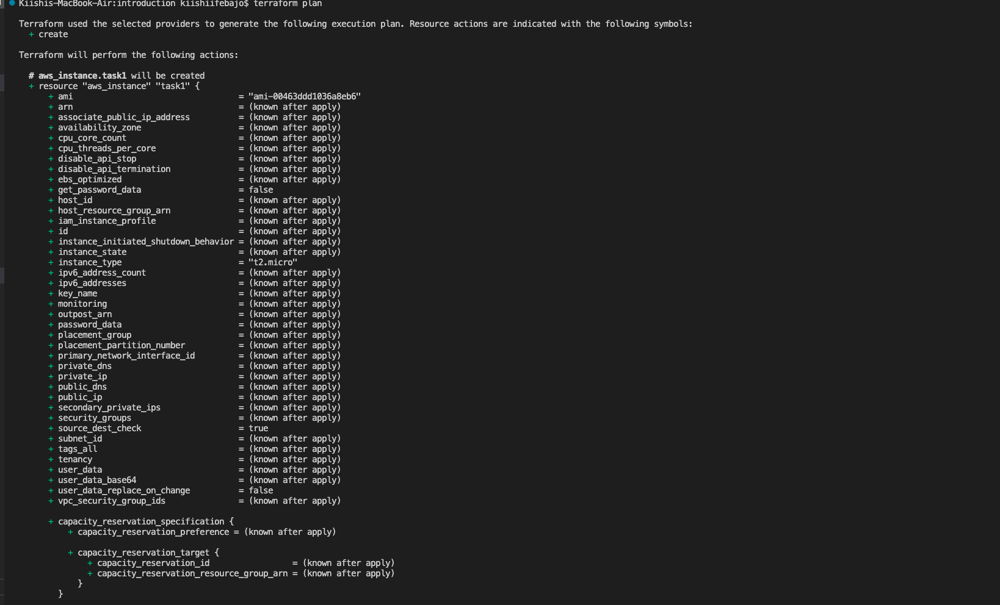
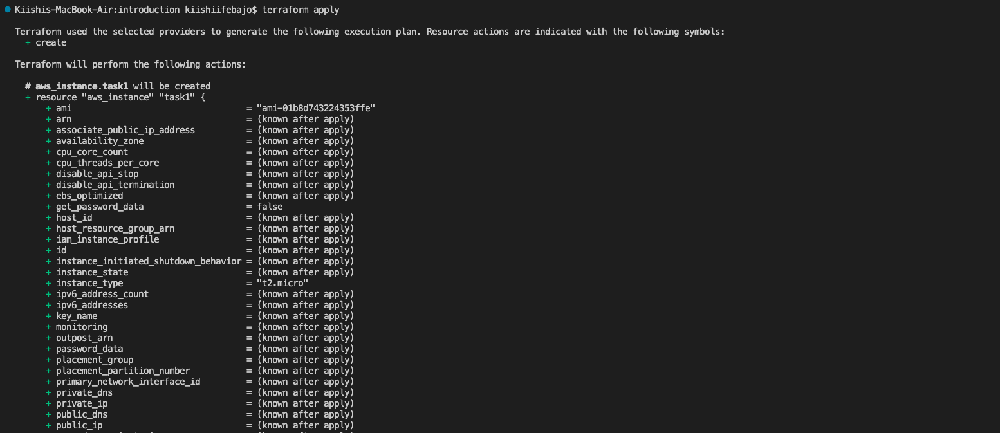

# Terraform Excercise
This file contains creating an EC2 Instance using Terraform

## Terraform Init
* This command initialises the working directory containing Terraform configuration files and install any required plugins.

## Terraform Plan
* This command creates an execution plan, which lets you preview the changes that Terraform plans to make to your infrastructure. 

## Terraform Apply
* This command creates or updates infrastructure depending on the configuration files.

## AWS Console

